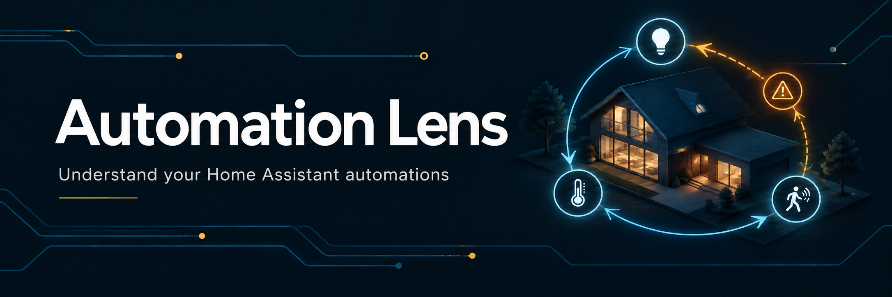

<p align="center"></p>

# Automation Lens

**Follow the chain. Find the conflict. Understand the automation.**

Automation Lens is a read-only command-line tool for exploring Home Assistant automations. It resolves device and entity references, builds a graph of their relationships and highlights potential feedback loops, conflicting actions, missing references and long-delay traps.

[Quick start](#try-the-offline-demo) · [Full guide](docs/GUIDE.md) · [JSON reference](docs/JSON.md) · [Dansk guide](docs/GUIDE.da.md) · [How analysis works](docs/ANALYSIS.md) · [Report an issue](https://github.com/Hovborg/automation-lens/issues)

> **Early release.** Findings are leads to investigate in your configuration. The analyzer uses a simplified model; a reported cycle does not prove that your house will enter a loop. It never runs Home Assistant actions.

## See what it does


*Real output from the included fictional dataset. The example deliberately contains conflicts and must not be installed in Home Assistant.*

| Explore | What you get |
| --- | --- |
| **Findings** | Potential loops, competing writes, unresolved references, long delays, contradictory conditions and overlapping automations. |
| **Explain** | Triggers, conditions and actions for automations matching a search. |
| **Chain** | The automations that listen to or change an entity. |
| **Simulate** | A simplified “what happens after this event?” trace at a chosen time. |
| **JSON** | Machine-readable findings for your own tools. |

## Try the offline demo

You need **Python 3.10 or newer** and Git. No Home Assistant account, token or connection is needed for the demo. You can also use **Code → Download ZIP**, extract it, and open a terminal in the extracted folder.

```shell
git clone https://github.com/Hovborg/automation-lens.git
cd automation-lens
python -m venv .venv
```

**Windows / PowerShell**

```powershell
.\.venv\Scripts\python.exe -m pip install .
.\.venv\Scripts\automation-lens.exe --data-dir examples/demo --findings
```

**Linux / macOS**

```sh
.venv/bin/python -m pip install .
.venv/bin/automation-lens --data-dir examples/demo --findings
```

If your system uses `python3`, use that for the `venv` command. Installation downloads PyYAML and build dependencies; subsequent demo analysis runs locally.

## Go one step deeper

After installation, use the executable path above in place of `automation-lens` below, or activate your virtual environment.

```shell
automation-lens --data-dir examples/demo --explain "relay"
automation-lens --data-dir examples/demo --chain light.demo_lamp
automation-lens --data-dir examples/demo "light.demo_lamp on" --time 23:30
automation-lens --data-dir examples/demo --findings --json
```

For your own system, [the full guide](docs/GUIDE.md#use-your-own-home-assistant-configuration) explains the four input files, token handling, fetching and interpretation. Reading exports from disk is also supported.

## Designed for careful inspection


- **Read-only toward Home Assistant.** Fetching uses REST reads and WebSocket registry listing. Analysis works on local files.
- **Your connection is explicit.** No built-in server address, SSH fallback or automatic background connection.
- **Private data stays in your chosen folder.** There is no upload service or telemetry. Exports and JSON reports can contain private information; keep them out of public issues.
- **Limitations are visible.** Templates, branches, integrations and runtime state can change the real outcome. See [analysis boundaries](docs/ANALYSIS.md).

## Development

```shell
python -m pip install -e ".[test]"
python -m pytest -q
```

Tests use synthetic configuration and fake API responses. They do not contact your Home Assistant instance. See [CONTRIBUTING.md](CONTRIBUTING.md) for a useful bug report format.

## About

Built by [Brian Hovborg](https://github.com/Hovborg). The project grew from a Danish tool called *Kortslutning*. Danish option aliases remain available for existing workflows; public documentation and reports are in English.

Code is available under the [MIT license](LICENSE). Home Assistant is a separate project; this is an independent community tool. Cover artwork is AI-generated illustration, while the example output comes from the actual program.
