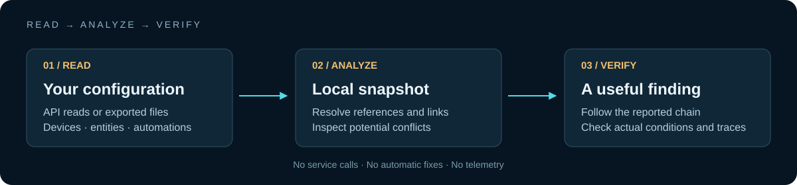

# What a finding can — and cannot — tell you

Automation Lens is a static analyzer and a small simulator. It reads exported configuration and builds a simplified model. Its findings guide inspection; they do not prove a fault in a running home.

## The model

1. Device IDs and registry-entry IDs are resolved into entity IDs where the export provides a mapping.
2. Triggers and action targets create links between automations and entities.
3. Recognized service names are grouped into effects such as on, off, toggle and set.
4. Selected time windows, state conditions and delays inform heuristics and traces.
5. Findings show the relationships that led to each warning, so a person can check the original configuration.

## Boundaries that matter

- A dependency cycle can stop immediately because an exact state condition does not match. The graph does not prove repeated execution.
- `choose`, `if`, templates, variables, integration-specific behavior and live state are not modeled completely. Branch extraction may overapproximate what can happen.
- Impossible-state checks are deliberately limited to active scalar main-state requirements joined with AND. Lists of allowed states, attributes, `match: any` and dynamic helper values are skipped by this check. Home Assistant's [state-condition semantics](https://www.home-assistant.io/docs/scripts/conditions/#state-condition) allow alternatives within a state list.
- Delayed opposing writes are often intentional. Severity is a prioritization hint, not a measured probability of failure.
- An entity missing from a registry export may still exist as a helper or a dynamically created entity. A missing-reference warning means “not resolved in this snapshot.”
- API exports may omit YAML package automations/scripts that have no editor configuration. Imported custom YAML tags and includes are not resolved automatically.
- Snapshot age is inferred from local file timestamps, or a compatible refresh stamp when present. It does not establish the current state of devices.
- A fetch downloads all responses before writing. Each file is replaced atomically, but the four replacements are not one filesystem transaction. An interrupted or disk-full write can require a fresh fetch.

## A useful verification workflow

Read the reported chain, locate the named automation in Home Assistant, compare exact trigger and condition values, and inspect its actual trace/history. Decide whether the behavior is intentional before editing it. Automation Lens never makes that edit for you.

For issue reports, reduce the case to fictional entity names and the smallest relevant configuration. Do not attach a real entity registry, token, webhook ID, location or family automation export.
