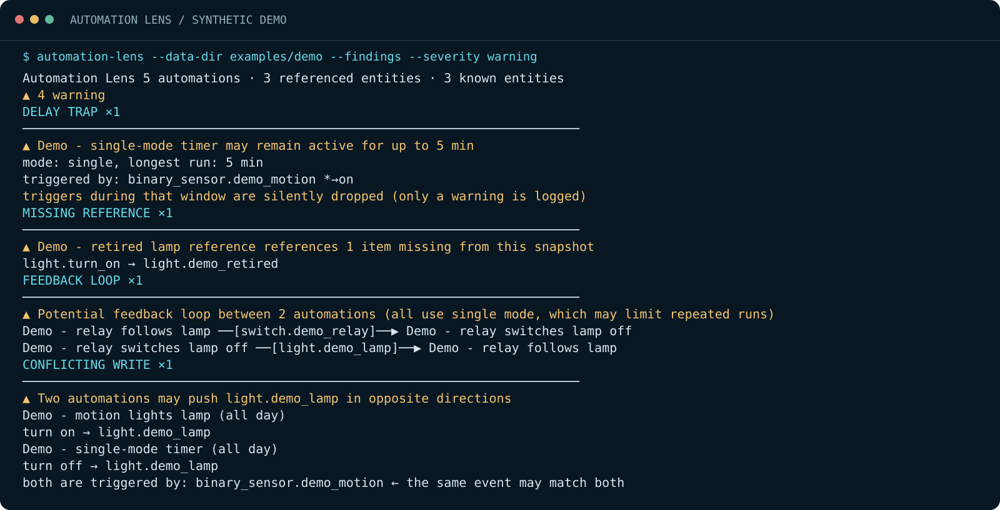

# Automation Lens — user guide

[README](../README.md) · [Dansk](GUIDE.da.md) · [JSON reference](JSON.md) · [Analysis boundaries](ANALYSIS.md)

## 1. Install in a virtual environment

Download the repository from GitHub or clone it. Open a terminal in the folder containing `pyproject.toml` and check `python --version`. Python 3.10 or newer is required.

On Windows:

```powershell
python -m venv .venv
.\.venv\Scripts\python.exe -m pip install .
.\.venv\Scripts\automation-lens.exe --help
```

On Linux or macOS:

```sh
python3 -m venv .venv
.venv/bin/python -m pip install .
.venv/bin/automation-lens --help
```

No administrator account or virtual-environment activation is required. The remaining commands use `automation-lens` as shorthand for the executable path above. Keep the repository folder: the example files and guides live there, outside the installed Python module.

## 2. Learn with the fictional home

```shell
automation-lens --data-dir examples/demo --findings
```



The fictional home has a lamp, a relay and a motion sensor. Five deliberately imperfect automations illustrate different findings:

| Example | What to investigate |
| --- | --- |
| Lamp controls relay; relay controls lamp | A cycle exists in the dependency graph. Its state conditions still matter: the graph alone does not show an endless runtime loop. |
| Motion turns the lamp on, while another rule turns it off later | Two rules write opposing states; a delayed off action can also be intentional. |
| A retired lamp is referenced | The reference is absent from this registry snapshot. |
| A five-minute delay runs in `single` mode | Further triggers can be ignored while the automation is already running. |
| Two rules share a trigger and target | Their overlap may be deliberate; inspect timing and conditions. |

The sample YAML is for analysis only. Do not paste it into a real Home Assistant installation.

## 3. Trace an entity or event

```shell
automation-lens --data-dir examples/demo --chain light.demo_lamp
automation-lens --data-dir examples/demo --explain relay
automation-lens --data-dir examples/demo "light.demo_lamp on" --time 23:30
```

`--chain` follows relationships around an entity. `--explain` searches automation aliases and related references. The positional event invokes the simplified simulator: quote the entity and state together, and use a 24-hour clock with `--time`.

Simulation does not trigger a Home Assistant event. A trace is a model of the exported configuration, not a live trace from the Home Assistant UI.

## Use your own Home Assistant configuration

Choose a folder outside the repository for real exports. The default is `./cache`, relative to your current working directory. `--data-dir` overrides `KS_DATA_DIR`, which overrides that default. Fetching replaces the four data files in the selected folder, so use a dedicated export folder.

### Option A: fetch with the API

Create a long-lived access token in your Home Assistant user profile. It inherits your account's access; it is not a restricted read-only token. The application itself performs only reads. Some configuration endpoints require an administrator account. Follow the official [Home Assistant authentication documentation](https://www.home-assistant.io/docs/authentication/) and [API documentation](https://developers.home-assistant.io/docs/api/rest/).

**PowerShell 7** can read the token without showing it or placing it literally in shell history:

```powershell
$env:KS_HA_URL = 'https://your-home-assistant.example'
$env:KS_HA_TOKEN = Read-Host 'Home Assistant token' -MaskInput
.\.venv\Scripts\automation-lens.exe --data-dir "$HOME/automation-lens-data" --fetch
Remove-Item Env:\KS_HA_TOKEN
.\.venv\Scripts\automation-lens.exe --data-dir "$HOME/automation-lens-data" --findings
```

Replace the example URL with your real Home Assistant base URL. Use its direct final URL: redirects are rejected to avoid forwarding authorization to another location. HTTPS certificate checks remain enabled. Plain HTTP is supported for a trusted local network, but does not encrypt the token in transit.

**Bash**:

```sh
export KS_HA_URL='https://your-home-assistant.example'
read -r -s -p 'Home Assistant token: ' KS_HA_TOKEN
printf '\n'
export KS_HA_TOKEN
.venv/bin/automation-lens --data-dir "$HOME/automation-lens-data" --fetch
unset KS_HA_TOKEN
.venv/bin/automation-lens --data-dir "$HOME/automation-lens-data" --findings
```

`HOMEASSISTANT_URL` / `HASS_SERVER` and `HOMEASSISTANT_TOKEN` / `HASS_TOKEN` are accepted as alternatives. `KS_*` takes priority. `--ha-url` overrides the URL; there is no token command-line option. Never put a token in a URL or commit it to a file.

Fetching reads entity/device registries through WebSocket, reads entity states to discover automations/scripts, and reads their editor configurations through REST. YAML package automations unavailable through the editor API can be skipped. A successful fetch therefore does not establish full coverage of every automation in your system. No SSH access is attempted.

### Option B: analyze files you already exported

Put these files together in a dedicated folder:

| File | Expected format |
| --- | --- |
| `device_registry.json` | Object with `data.devices`, a list of device records. |
| `entity_registry.json` | Object with `data.entities`, a list of entity records. |
| `automations.yaml` | List of Home Assistant automation definitions. |
| `scripts.yaml` | Optional mapping of script names to definitions containing `sequence`. |

The [example folder](../examples/demo) shows minimal valid shapes. Registry snapshots use the same outer shape as Home Assistant's registry storage files. Work with exported copies; do not edit live `.storage` files. If your configuration is split across packages, prepare a combined copy for analysis yourself. Custom YAML includes and templates are not expanded by this tool.

## Filter and export findings

```shell
automation-lens --data-dir path/to/data --findings --severity warning
automation-lens --data-dir path/to/data --findings --json > findings.json
```

The JSON output is written to stdout; snapshot-age messages go to stderr. Severity filters apply to JSON as well as text. A zero exit code means the requested analysis completed, including when findings are present. Exit 1 indicates a runtime/input/connection error; argument errors use exit 2. Do not treat exit 0 as a clean bill of health.

See the [JSON reference](JSON.md) for the findings schema, public kind and severity values, and simulation trace fields.

## Troubleshooting

| Symptom | Next step |
| --- | --- |
| `python` is missing | Install Python from [python.org](https://www.python.org/downloads/) and reopen the terminal. On Unix, try `python3`. |
| No `automation-lens` command | Use the full virtual-environment executable path shown above. |
| Missing data files | Check `--data-dir`, then try the bundled demo or fetch into a dedicated folder. |
| Invalid YAML or JSON | Check indentation and file shapes against the demo. The tool uses safe YAML parsing and does not expand Home Assistant includes. |
| HTTP 401 / 403 | Check the token, URL and the account's permissions. Revoke and recreate a token if necessary. |
| Redirect refused | Use the final direct Home Assistant URL and check proxy routing. |
| TLS / network error | Check the certificate and connectivity from the machine running the command. Do not disable certificate verification. |
| A surprising finding | Re-read the exact automation in Home Assistant, inspect its conditions and traces, then compare with [the model's limitations](ANALYSIS.md). |

## Update or remove

To update a Git checkout, pull the desired revision and reinstall it into the virtual environment with `python -m pip install .` using that environment's Python. Re-run the demo before analyzing your exports. Keep a copy of any local code changes before updating.

To remove the tool, use the environment's Python to run `-m pip uninstall automation-lens`, or remove its dedicated virtual environment when no longer used. Exported data is independent and stays in the folder you chose. The program creates no service, scheduled task or Home Assistant automation.
